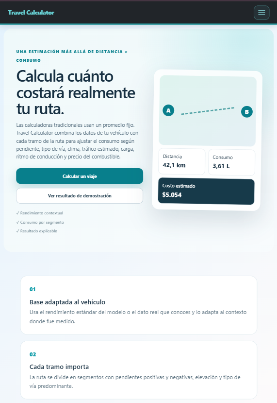
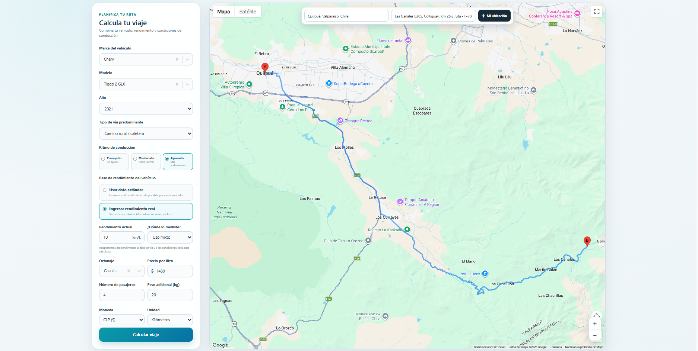
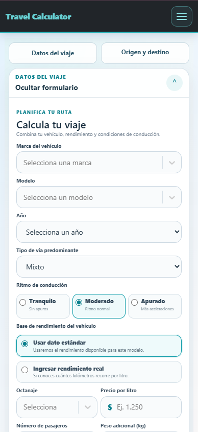
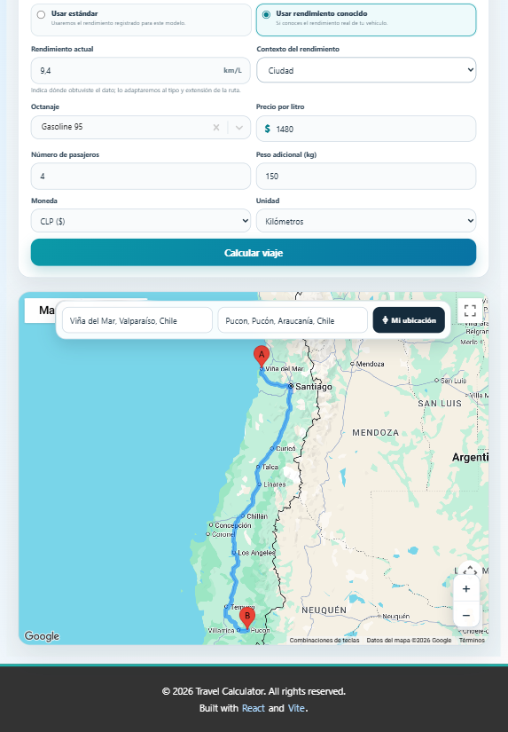
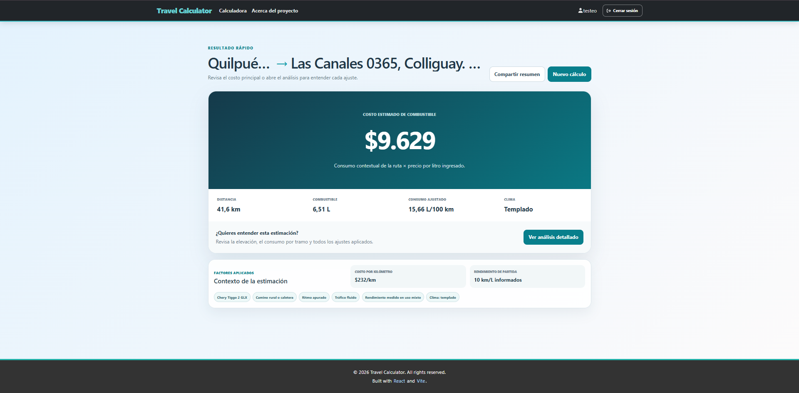
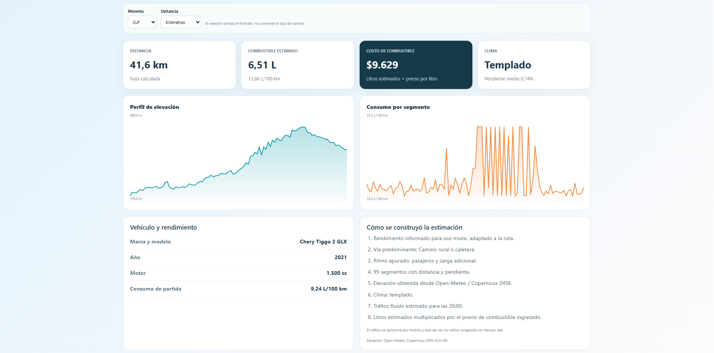
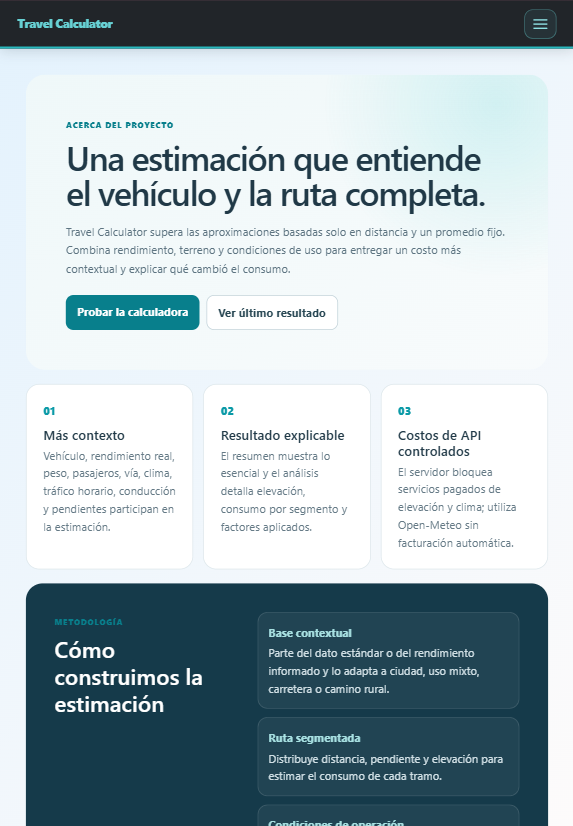
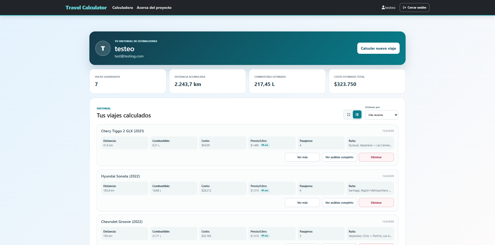
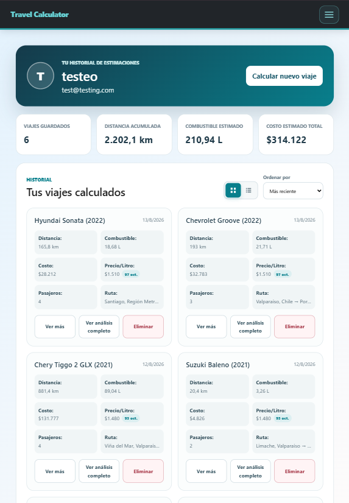

# Travel Calculator

Aplicación full-stack que estima el consumo y costo de un viaje considerando más que la distancia: vehículo, rendimiento real o estándar, pendiente, tipo de vía, clima, tráfico horario, ritmo de conducción, pasajeros, carga y precio del combustible.



## El problema

Las calculadoras tradicionales suelen multiplicar distancia por un consumo promedio. Ese enfoque no explica por qué una ruta urbana, una subida prolongada o un vehículo cargado pueden cambiar el resultado.

Travel Calculator divide la ruta en segmentos y aplica factores medibles para entregar una estimación más contextual, visual y explicable. No pretende reemplazar una medición homologada ni el consumo observado del vehículo.

## Qué aporta el proyecto

- Selección de marca, modelo, año, octanaje y perfil de vía.
- Catálogo curado: sólo muestra vehículos con consumo, peso y combustible suficientes para calcular.
- Origen mediante búsqueda o geolocalización, con Santiago como ubicación inicial segura.
- Ruta interactiva con zoom, arrastre y direcciones de Google Maps.
- Elevación y clima mediante Open-Meteo, sin facturación automática.
- Rendimiento estándar o personalizado, adaptado al contexto donde fue medido: ciudad, uso mixto, carretera o camino rural.
- Ajustes por pendiente, tráfico esperado según horario, trayectos cortos, ritmo de conducción, pasajeros y carga.
- Resumen rápido y análisis detallado con gráficos por segmento.
- Formato monetario chileno y unidades configurables.
- Historial autenticado con JWT y persistencia en PostgreSQL.
- Historial con vistas de cuadrícula y lista, rutas resumidas y acceso al análisis completo de cada viaje.
- Resultado demostrativo accesible sin registro.
- Diseño responsive para teléfonos, tablets y escritorio.

## Capturas

### Planificación de la ruta

El formulario permite combinar los datos técnicos del vehículo con el rendimiento que realmente observa el conductor. El mapa permanece como elemento principal para buscar direcciones, utilizar la ubicación actual y revisar visualmente la ruta calculada.



<table>
  <tr>
    <td width="50%">
      <strong>Formulario compacto en iPhone 12 Pro</strong><br><br>
      
    </td>
    <td width="50%">
      <strong>Ruta completa en iPad Air</strong><br><br>
      
    </td>
  </tr>
</table>

### Resultado rápido

El primer nivel responde cuánto combustible y dinero requerirá el viaje. También expone costo por kilómetro, rendimiento de partida y los factores contextuales aplicados, sin obligar al usuario a revisar de inmediato todo el modelo.



### Análisis explicable

El detalle presenta elevación y consumo por segmento, vehículo y rendimiento utilizados, condiciones de operación y la secuencia con la que se construyó la estimación.



<table>
  <tr>
    <td width="50%">
      <strong>Compartir la estimación</strong><br><br>
      
    </td>
    <td width="50%">
      <strong>Metodología y arquitectura</strong><br><br>
      
    </td>
  </tr>
</table>

### Historial de estimaciones

Los usuarios autenticados pueden alternar entre tarjetas visuales y una lista horizontal de historial, ordenar los viajes y volver a abrir su análisis completo.



<details>
  <summary><strong>Ver también la cuadrícula responsive en iPad Air</strong></summary>
  <br>
  
</details>

La lista aprovecha el ancho del monitor para presentar vehículo, fecha, métricas, ruta y acciones en filas de historial. La cuadrícula mantiene tarjetas compactas para comparar varios viajes visualmente en tablets y teléfonos.

## Estado del proyecto

- Rama estable: `master`.
- Suite backend: 17 pruebas automatizadas.
- Frontend: ESLint y build de producción verificados.
- Dependencias npm: 0 vulnerabilidades conocidas al 11 de agosto de 2026.
- Despliegue público: pendiente.

## Arquitectura

```text
React + Vite ── HTTP/JSON ──> Flask API ── SQLAlchemy ──> PostgreSQL
      │                            │
      ├── Google Maps              ├── Open-Meteo
      └── sessionStorage           └── NHTSA
```

El último resultado se conserva en `sessionStorage` para sobrevivir una recarga dentro de la sesión sin incluir datos en la URL. Los viajes de usuarios autenticados se guardan en PostgreSQL.

## Stack técnico

| Área | Tecnologías |
| --- | --- |
| Frontend | React 18, Vite, React Router, Bootstrap, Framer Motion |
| Mapas | Google Maps JavaScript API, Places y Directions |
| Backend | Flask, SQLAlchemy, Flask-Migrate, JWT, Bcrypt |
| Datos | PostgreSQL, Open-Meteo, NHTSA |
| Calidad | ESLint, unittest, npm audit |
| Despliegue | Render Blueprint, Gunicorn |

## Rutas principales

| Ruta | Propósito |
| --- | --- |
| `/` | Presentación y acceso a la demostración |
| `/calculadora` | Formulario y mapa interactivo |
| `/resultado` | Resumen rápido del último cálculo |
| `/resultado/detalles` | Métricas, factores y gráficos por segmento |
| `/about` | Metodología, arquitectura y limitaciones |
| `/profile` | Perfil e historial autenticado |
| `/login`, `/register` | Acceso y creación de cuenta |

## Ejecución local

### Requisitos

- Python 3.12.
- Pipenv.
- Node.js 18 o superior y npm.
- PostgreSQL 12 o superior.
- Clave restringida para Google Maps JavaScript API.

### Instalación

Desde la raíz del repositorio:

```powershell
Copy-Item .env.example .env
pipenv install
npm.cmd install
```

Configura `.env`, crea la base indicada por `SQLALCHEMY_DATABASE_URI` y aplica las migraciones:

```powershell
pipenv run flask db upgrade
```

### Desarrollo

Ejecuta backend y frontend en terminales separadas:

```powershell
# Terminal 1
pipenv run backend

# Terminal 2
npm.cmd run dev
```

Abre <http://localhost:5173>. La API queda disponible en <http://localhost:5000/api/>.

En PowerShell se utiliza `npm.cmd` para evitar conflictos con políticas que bloquean `npm.ps1`.

## Demostración sin registro

Desde la portada selecciona **Ver resultado de demostración**. Este flujo utiliza datos locales representativos y permite revisar `/resultado` y `/resultado/detalles` sin crear una cuenta, consultar APIs ni escribir en la base de datos.

## Variables de entorno

| Variable | Uso |
| --- | --- |
| `SQLALCHEMY_DATABASE_URI` | Conexión privada a PostgreSQL |
| `JWT_SECRET_KEY` | Firma de tokens JWT |
| `DEBUG` | Modo debug de Flask; debe ser `False` en producción |
| `VITE_BACKEND_URL` | URL pública del backend |
| `VITE_GOOGLE_MAPS_API_KEY` | Clave pública restringida de Google Maps |
| `VITE_MAP_ID` | Identificador opcional del mapa |
| `NHTSA_BASE_URL` | URL base del servicio NHTSA |
| `ELEVATION_PROVIDER` | Proveedor de elevación; `open_meteo` por defecto |
| `PAID_GOOGLE_APIS_ENABLED` | Debe permanecer `False` para bloquear endpoints pagados del backend |
| `OPENWEATHERMAP_API_KEY` | Compatibilidad heredada; Open-Meteo funciona sin clave |

> La clave de Google Maps se ejecuta en el navegador. Debe restringirse por dominio y por API desde Google Cloud Console. `PAID_GOOGLE_APIS_ENABLED=False` bloquea las rutas pagadas del backend, pero no sustituye las cuotas y restricciones de la API JavaScript usada por el mapa.

## Comandos de calidad

```powershell
# Frontend
npm.cmd run lint
npm.cmd run build
npm.cmd audit

# Backend
pipenv run python -m unittest discover -s tests -v

# Migraciones
pipenv run flask db current
pipenv run flask db heads
```

## Despliegue

`render.yaml` define una propuesta de infraestructura para:

- frontend estático React/Vite;
- API Flask con Gunicorn;
- PostgreSQL administrado.

Antes de desplegar:

1. Configura `VITE_BACKEND_URL` y `CORS_ORIGINS` con los dominios definitivos.
2. Mantén `DEBUG=False` y `PAID_GOOGLE_APIS_ENABLED=False`.
3. Restringe Google Maps al dominio HTTPS del frontend.
4. Aplica `pipenv run flask db upgrade` durante el release del backend.
5. Prueba geolocalización, cálculo, autenticación y demo en el entorno publicado.

## Decisiones técnicas

- **Resultado en dos niveles:** un resumen rápido responde primero cuánto costará; el detalle explica elevación, consumo y factores.
- **Procesamiento por segmentos:** permite representar pendientes distintas dentro de una misma ruta.
- **SVG nativo:** los gráficos evitan incorporar una biblioteca pesada adicional.
- **Proveedores gratuitos por defecto:** clima y elevación usan Open-Meteo; los endpoints pagados del backend permanecen deshabilitados.
- **Disponibilidad basada en datos:** NHTSA sirve como referencia, pero el formulario sólo habilita combinaciones validadas en PostgreSQL.
- **Demo local:** mantiene evaluable el proyecto incluso si la API o base de datos están suspendidas.
- **Fallbacks explícitos:** cuando un proveedor falla, el sistema evita presentar precisión inexistente como un dato real.

## Limitaciones conocidas

- El resultado es una estimación y depende de la calidad de los datos del vehículo y la ruta.
- El tráfico se aproxima por horario y tipo de vía; no corresponde a congestión en tiempo real.
- La velocidad efectiva, neumáticos, estado mecánico y hábitos reales pueden cambiar el consumo observado.
- La calibración con consumos reales todavía requiere más muestras de usuarios.
- El historial aún no incluye paginación para cuentas con grandes volúmenes de viajes.
- La suite automatizada cubre backend; las pruebas E2E del frontend siguen pendientes.

## Estructura

```text
app.py                  Entrada y factory de Flask
backend/                Modelos, rutas, servicios y cálculo
docs/screenshots/       Capturas utilizadas por la documentación
migrations/             Historial de migraciones de base de datos
src/                    Aplicación React
tests/                  Pruebas automatizadas del backend
render.yaml             Propuesta de despliegue en Render
```

Consulta [DEVELOPMENT_NOTES.md](DEVELOPMENT_NOTES.md) para el estado técnico y [CHANGELOG.md](CHANGELOG.md) para el historial de versiones.

## Autor

Desarrollado por [Jorge Oteiza](https://github.com/JorgeOteiza).
